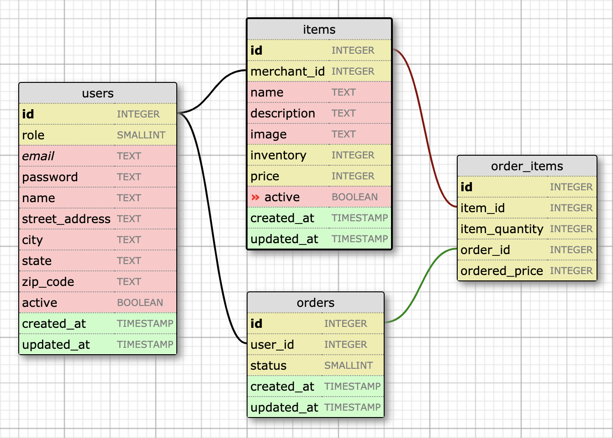
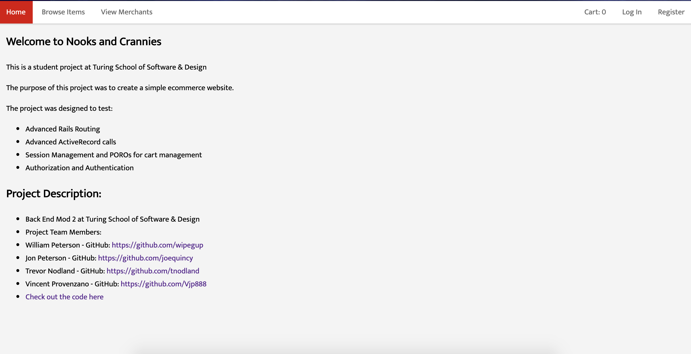

### Little Shop of Horrors

This is a student project from the Turing School of Software & Design as part of the Module 2 backend Software Development Program.  This project tasked us with creating a fictional E-Commerce website. This website would be able to facilitate Sessions of users. Allow the management of orders and items placed and created by users as well as preventing the deletion of information through the use of enabling and disabling items/orders.

-Take a look at the live website [here](https://nooks-and-crannies.herokuapp.com/)
-Take a look at the project [here](https://github.com/turingschool-projects/little_shop_v2)
-Team Members:
    William Peterson - [GitHub](https://github.com/wipegup)
    Jon Peterson - [GitHub](https://github.com/joequincy)
    Trevor Nodland - [GitHub](https://github.com/tnodland)
    Vincent Provenzano - [GitHub](https://github.com/Vjp888)

### Tools

  * Ruby on Rails 5.1.6
  * ActiveRecord - PostgreSQL

## Gems
  * FactoryBot
  * RSpec-rails
  * Shoulda-Matchers
  * Capybara
  * simplecov

### Testing
  RSpec was used as the primary testing suite

  SimpleCov was used to ensure proper coverage of our tests

  Shoulda-Matchers was used to aid in validation of our models

  Tests were completed in a hybrid of top down and bottom up development.
  We started with feature tests that would then break into model tests as needed for core functionality.

### Setup
  You will need to have PostgreSQL installed and ready for this app to work correctly

  Clone down the repo and run ```bundle install ```

  then run ```rails db:{drop,create,migrate,seed}``` this will populate the database for testing a viewing live.

  From here you can run ```rspec``` in the root to run our tests or visit the ```spec``` folder to view individual tests.

  running ``` rails s ``` then visiting ```localhost:3000``` will allow to you view the website live from the code itself.

### Database Layout


### Homepage

